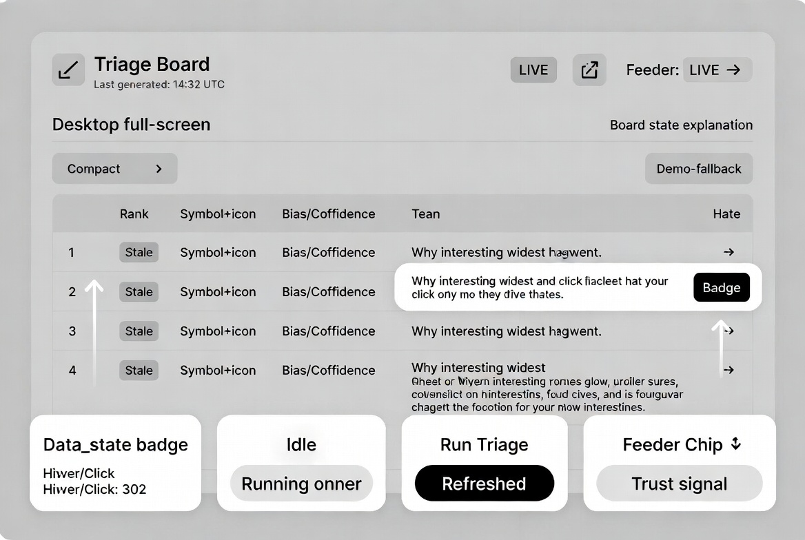
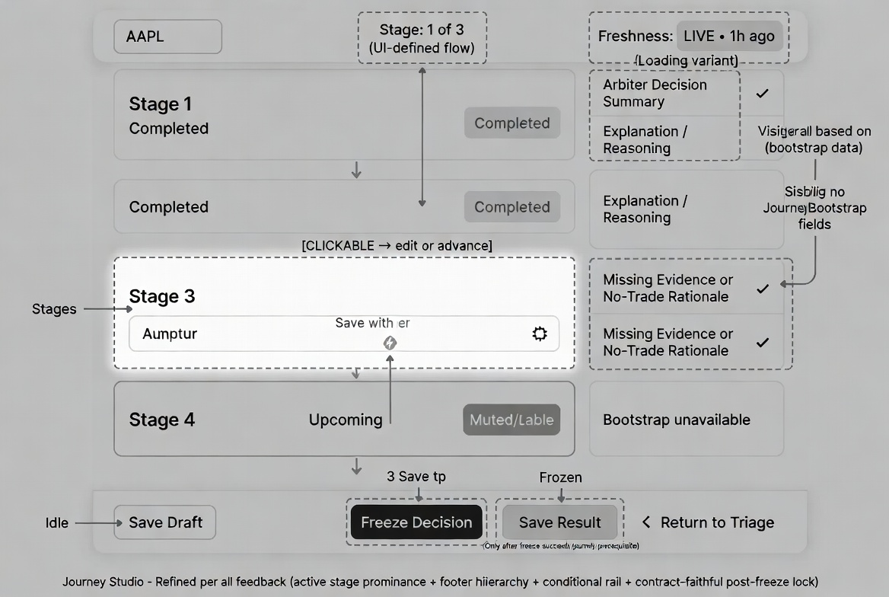
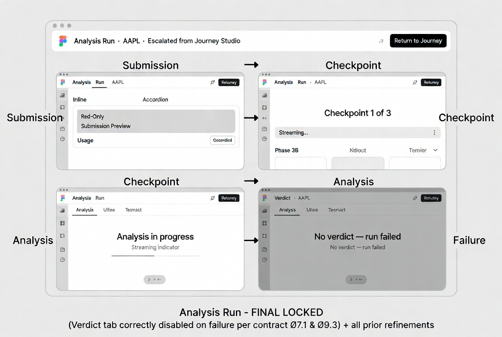
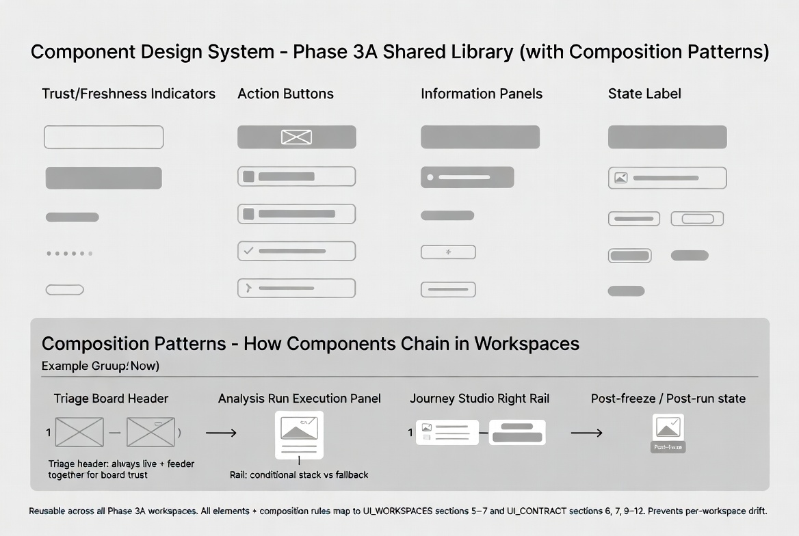

# AI Trade Analyst – Phase 3A Visual Appendix

**File:** `docs/ui/VISUAL_APPENDIX.md`  
**Status:** Active  
**Purpose:** Single reference sheet containing every final visual artifact produced in the design phase. All images are contract-faithful and implementation-ready.

## Full Visual Appendix (one-page reference)

## Individual Artifacts (for detailed zoom)

- **Triage Board** (final locked)  
  

- **Journey Studio** (final locked)  
  

- **Analysis Run** (4-state lifecycle, final locked)  
  

- **Component Design System + Composition Patterns** (full library)  
  

## Usage Notes

- All four artifacts map directly to `UI_WORKSPACES.md` sections 5–7 and `UI_CONTRACT.md`.
- Use the combined appendix for quick reference or presentations.
- Use individual images when implementing or reviewing a specific workspace.
- See `DESIGN_NOTES.md` for the written decisions behind each visual choice (per-row staleness, freeze lock, Save Result gating, tab persistence, etc.).

This appendix completes the visual layer of Phase 3A. Implementation can now proceed as component assembly using the shared library and composition patterns.